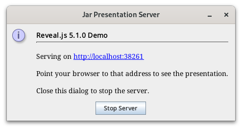

# Jar Presenter

A tool to package a web-based presentation into a executable jar with a tiny
HTTP server. When executed, the HTTP server is started to serve the
presentation.



The Jar Presenter requires Java 11 or newer.
Note that earlier releases of Java 11 had a bug and were not able to open a
browser on Linux. In that case copy-paste the URL to your running browser.

## Features

### Server
The server is started with the sub-command `server`. It starts a minimalistic
HTTP server and serves the presentation included in the jar.

---
**IMPORTANT**

The minimalistic HTTP server
* does not implement any security
* assumes a well behaving client (e.g. a "standard" browser)
* binds to localhost, hence is only reachable from the local machine

---

By default a small GUI dialog is opened to show the server address and to
stop the server (see above). Use `-t` to use terminal only.

If requested with `-b` the default web browser is started automatically and
will show the presentation.

**Help output:**

```
$ java -jar jar-presenter-0.1.0-SNAPSHOT.jar server --help
server - starts a web server to serve the presentation
      USAGE: java -jar jar-presenter.jar server [-b] [-v] [-t] [port]
        -b       immediately start the (default) browser
        -v       increase logging output
        -t       Terminal mode. Don't start GUI.
        port     use given port (default is random)
```


### Extract
With the sub-command `extract` the contained presentation is extracted to the
given directory. The directory is created if it doesn't exist.

**Help output:**

```
$ java -jar jar-presenter-0.1.0-SNAPSHOT.jar extract --help
extract - extract the contained presentation to the given directory
      USAGE: java -jar jar-presenter.jar extract [-f] <target-dir>
        -f   Overwrite existing files.
```


### Build
With the `build` sub-command a new jar-presenter with a new presentation can be
created. This command takes the Java classes from the current jar and combines
them with a presentation on disk into a new jar.

**Help output:**

```
$ java -jar jar-presenter-0.1.0-SNAPSHOT.jar build --help
build - build a NEW presentation jar for given presentation
      USAGE: java -jar jar-presenter.jar build [-f] [-i <start-page>] [-t <title>] <new-jar-name> <presentation-dir>
        -i <start-page>
                 defines the start page of the presentation to be used instead
                 of index.html
        -t <title>
                 title of presentation. Used e.g. in server popup.
        -f       overwrite existing jar
        new-jar-name
                 name of the new jar to create
        presentation-dir
                 directory of the presentation to include in new jar
```


## The Presentation

The presentation could be any static content that is deliverable from web
server, but it _needs_ a start page.

By default the start page is called `index.html`. If the start page has a
different name, a file called `jarp-metadata.properties` can be created to
define the start page with the entry `start-page`.

If the start page should be `Presentation.html` and the title of the
presentation is "My Presentation", `jarp-metadata.properties` contains:

```
title=My Presentation
start-page=/Presentation.html
```

When using the sub command `build`, the values of the options `-i` and `-t`
are used to create this file.


## Building Jar-Presenter

Normal build is easy: `mvn clean package`

The normal build doesn't contain a real presentation. It is runnable, but only
contains a single [HTML page](src/main/asciidoc/jar-presenter.adoc) explaining
Jar-Presenter.

To build an example with a real presentation run `mvn clean package -Pexample`.

This will create a jar that contains the demo presentation for
[reveal.js](https://revealjs.com/).

